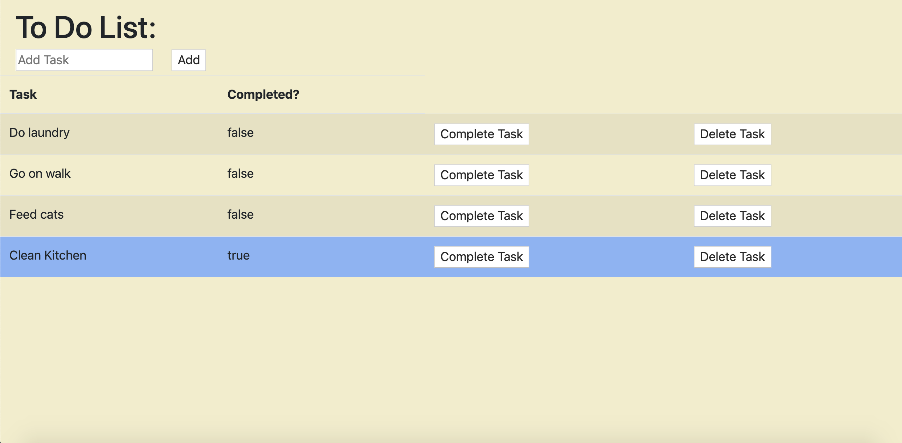

## To Do List 
The To Do List: The Quintessential productivity tracker. Half the battle of a to-do-ist is finding a blank piece of paper and something to write with. The to-do-list app eliminates that issue, allowing users to add, complete, and remove tasks - all on one user friendly page. 

##Built With
- HTML/CSS
- JavaScript 
- JQuery
- SQL 

##Getting Started
- 1) Clone/Download Repository 
- 2) Open project in preferred code editor
- 3) Open terminal, npm install 
- 4) In terminal, npm start 
- 5) Open browser, enter localhost:5000 in URL bar

##Prerequisites
- 1) Node.js
- 2) postgresql 

##Steps to get the development environment running.
- 1) Clone/Download Repository 
- 2) Open project in preferred code editor
- 3) Open terminal, npm install 
- 4) In terminal, npm start 
- 5) Open browser, enter localhost:5000 in URL bar

##Screen Shot

##Completed Features
- 1) Input field for user to enter task / 'add' task button 
- 2) A list of tasks for user to view
- 3) 'Complete Task' and 'Delete Task' buttons for each task

- Potential Features To Be Added: 
- 1) Prioritize button (drop down menu(?)) 